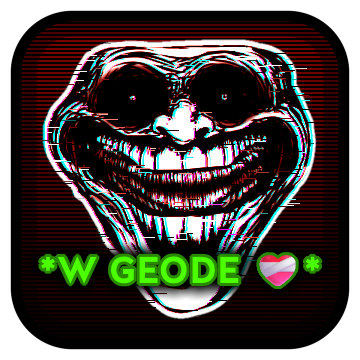

# Sigma Phonk Edit Mode

Turn your skibidi Geometry Dash Gameplay into the most Sigma Phonk Edit and feel the rizz, or something! *How do you do, fellow kids?*

This mod makes it so any action *(configurable)* you make in-game has a *(configurable)* chance of flexing your raw skill by turning your gameplay into a based sigma phonk edit ready to be posted to your chad TikTok account!
The mod has the following features:

- **Configurable Chance:** Wanna make EVERY input turn into a banger Phonk Edit? Or do you want to be jumpscared by the 1% chance Skibidi Phonk of doom? Can do both!
- **Configurable Min/Max %:** Want a phonk edit only on the last few moments of a level? You can easily configure after which percent can the effect happen!
- **Configurable Inputs:** Don't want the movement buttons in platformer to trigger your rizz? Disable them! Do you want your chad edit to happen On Click, or do you want it On Click Release so you can flex those sigma wave skills? Can do both!
- **Configurable Effect Length:** Want the effect to last a full 5 seconds to really feel the W rizz? Or do you want it to be shorter so you can have a ton of sigma edits in rapid succession? can do both!
- **Custom Sounds/Images:** Do you not like the music and images the mod includes? Or do you simply want MORE??? No worries, you're in control! You can very easily add your own sounds and images to be used in the mod!

# Adding Custom Assets (Images/Sounds)
Adding custom Images & Sounds to the mod is very simple! To do so, simply open the Mod's config folder (Open the mod's settings popup, locate the Folder button with a Gear icon on it at the bottom right corner of it and then click it) and create 2 folders here, called "images" and "phonk".

- The "images" folder, needless to say, will contain your custom images! Only .png format is supported.
- The "phonk" folder will contain your custom sounds! Supported formats are .ogg, .mp3 and .wav. No, of course you aren't restricted to using Phonk songs. Place whatever u want there!

However, there's some important notes you need to know beforehand:

### Important Notes
- PLEASE make sure your filenames DO NOT CONTAIN ANY SPECIAL CHARACTERS!!!!!!!! This can (and most likely WILL) cause issues with the mod, either your images/sounds not playing or straight up crashing your game.
- When it comes to SFXs, it's strongly recommended you trim them to max 5s instead of placing full song files there. Placing sound files that are too big/too long can lag your game when they play!! (Of course, this isn't that big of a deal since when they play the game is already meant to "freeze" for the edit effect anyway, but just as a heads up. [This can be pretty funny though](https://x.com/DeepResonanceX/status/1980916712569729245))
- Recommended resolution for images is 300px (mostly for height). Or if you're playing on medium, 150px.

# Credits
## Main Credits
- Based on generic TikTok/Youtube Shorts Phonk edits.
- "W Speed" featured based on the popular iShowSpeed edit memes of the same name.
- Inspired by a similar Minecraft mod by Ekically. [Original Tweet Here](https://x.com/Ekically/status/1979313933065555996)
- Zilko & Erymanthus' GrayscaleMode mod - Used as reference to fix issues with shaders.
- zMarc - Fellow creator of another separate mod with the same premise, inspired by the same Minecraft mod. Mutual endorsement.

## Music Credits
- Hensonn - Sahara  
- Kordhell - Live Another Day
- ATLXS - PASSO BEM SOLTO (Slowed)
- Spreen - Respeito
- KSLV - Disaster
- MUPP & Sadfriendd - Vendetta!
- PlayaPhonk - Phonky Town
- InterWorld - METAMORPHOSIS
- Dxrk - RAVE
- Kordhell - Murder in My Mind
- DVRST - Close Eyes
- 6ynthmane, RXDXVIL - BRAZILIAN DANCA PHONK
- sma$her & MXZI - Acelerada
- Nakama, Mc Staff, EP - DIA DELICIA

## Image Credits
Honestly, these phonk/sigma/void edits of trollface and various memes are so generic and so widespread it's probably impossible for me to find every single creator for the images included. So, credit to their respective artists and authors.
However, i'll list the ones i'm aware of:

- Skull, Skull with Crossbones & Hot Face emojis: by Apple, from iOS 18.4.
- 3D skull with raised eyebrow: Memoji App (i think).
- Moyai emoji: by Apple, from iOS 10.2-18.4.
- Extremely exaggerated creepy front-facing trollface: ScorchVx (i think, again).
